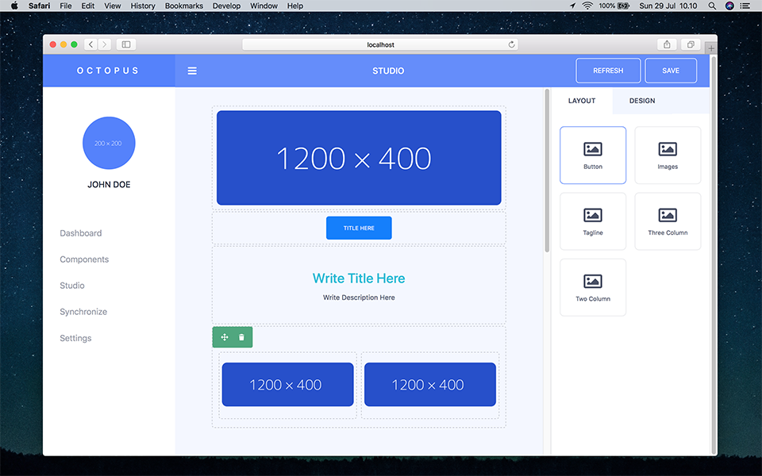

# Octopus Builder

Octopus are page builder and content management system with focus on centralize and micro-frontend architecture. We can make multiple client website with monolith or microservices architecture, but we stored any component on the server which is on builder.

So, we can focus on data and create reusable component cross server and clients., with configurable design or template.

## Author

[Muhibbudin Suretno](https://github.com/muhibbudins) [muhibbudinsuretno1@gmail.com]

## License

This project under MIT license